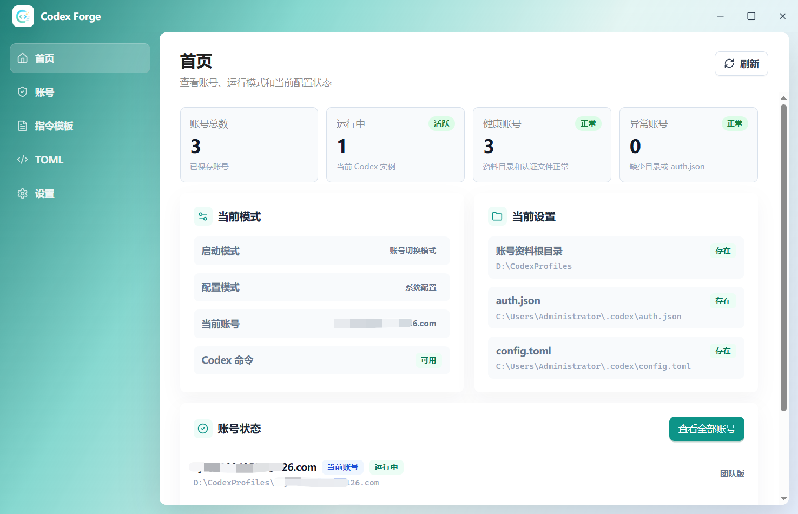

<p align="center">
  <a href="README.md">简体中文</a> |
  <a href="README.en.md">English</a>
</p>

<p align="center">
  
</p>

<h1 align="center">Codex Forge</h1>

<p align="center">
  <b>Codex multi-account and multi-instance management · Auth management · Visual TOML / instruction workspace</b>
</p>

<p align="center">
  A local multi-account and multi-instance manager for Codex inside the ChatGPT desktop app on Windows. It brings login profiles, <code>auth.json</code>, <code>config.toml</code>, instruction templates, and usage snapshots into one interface. You can switch accounts before launching ChatGPT or run multiple isolated ChatGPT clients.
</p>

<p align="center">
  
  
  
</p>

<p align="center">
  
  
  
  
</p>

---

## 📖 Overview

**Codex Forge** is not a replacement for Codex. It is a local workspace for Codex accounts, multi-instance launches, and configuration. It turns common terminal-side operations into desktop app workflows:

- ✨ **Multiple accounts**: Manage multiple Codex account profiles in one place.
- 🔑 **Flexible auth import**: Add accounts through browser OAuth, the current default account, or a local `auth.json` file.
- 🔄 **Smooth switching**: Write the selected account to `~/.codex/auth.json` automatically.
- 🛡️ **Config isolation**: Account-switching mode always uses the system `~/.codex/config.toml`; isolated multi-instance mode uses each account's `CodexHome/config.toml`.
- 🛠️ **Visual editing**: View and edit the active `~/.codex/config.toml`.
- 📝 **Instruction templates (prompt injection)**: Save common prompts as Markdown templates and switch Codex's global behavior profile with one click. The built-in prompt can break restrictions and support effects such as SQL injection testing and reverse engineering.
- 📊 **Status monitoring**: View account health, running status, and usage snapshots.
- 🚀 **Selectable launch modes**: Supports account switching and isolated multi-instance mode for running multiple ChatGPT clients.
- 🌐 **Bilingual UI**: Built-in Chinese / English switching for different language environments.
- 🔔 **Version updates**: Check for updates in the app, review release notes, download in the background, and restart to install.

## 🖼️ Software Preview

<p align="center">
  
</p>

## ⚡ Features

| Module | Details |
| :--- | :--- |
| 👥 **Profile management** | Create, rename, and delete account profiles. Data is stored in `~/Documents/CodexProfiles` by default. |
| 🔑 **Auth import** | Uses the official Codex App Server for ChatGPT browser sign-in, and supports saving the current account or importing `auth.json`. |
| 🚀 **One-click switch and launch** | Writes the selected account into the current user's `.codex` directory and launches ChatGPT. If ChatGPT is running, the app prompts you to close it first. |
| 📦 **Isolated multi-instance launch** | Featured capability. In multi-instance mode, prepares a per-account `CodexHome`, `APPDATA`, `LOCALAPPDATA`, `--user-data-dir`, and full `CodexPortableApp` copy to avoid accounts overwriting each other. |
| 📊 **Usage snapshots** | Uses the official Codex App Server to read and cache ChatGPT Codex usage limits. |
| 🛠️ **TOML editor** | Opens and saves the active `config.toml`, with an automatic backup before saving. |
| 📝 **Instruction templates (prompt injection)** | Saves Markdown prompt templates locally. Enabling a template copies it into the active Codex config directory and points `model_instructions_file` in `config.toml` to that template. |
| ⚙️ **Launch and directory settings** | Switch launch modes, migrate the account profile root, and enable Codex Forge to start after Windows sign-in. |
| 🔔 **In-app updates** | Supports silent update checks, manual update checks, release notes, background downloads, and restart-to-install. |
| 🌐 **Language and project links** | Supports Chinese / English UI switching and provides GitHub and Gitee project links in the About area. |

## ✨ Highlights

### 1. 🛡️ Isolated Account Profiles

Each account profile stores its own login credentials and config:

```text
~/Documents/CodexProfiles/<profile-name>/auth.json
~/Documents/CodexProfiles/<profile-name>/CodexHome/config.toml
```

Account-switching mode only replaces `auth.json`; global Codex settings such as model and proxy always use the system `~/.codex/config.toml`. Isolated multi-instance mode uses each account's own `CodexHome/config.toml`.

### 2. 🔑 Auth Management

There are three ways to add an account:

- 🌐 **Browser OAuth**: Uses ChatGPT's built-in Codex App Server to open the official sign-in flow and saves the result only to the new profile.
- 💾 **Save current account**: Copies the current system `~/.codex/auth.json`.
- 📁 **Upload local file**: Imports an existing Codex login file from disk.

> 💡 Usage refresh runs through the official App Server. Updated authentication is written back to the matching profile.

### 3. 🛠️ Visual TOML Editing with Backups

Codex Forge reads the active config file:

```text
~/.codex/config.toml
```

Before saving changes, it validates the TOML content and backs up the old file to:

```text
%LOCALAPPDATA%/CodexForge/backups/config-toml/
```

### 4. 📝 Instruction Template Management (Prompt Injection)

Instruction templates let you quickly switch Codex's system-level behavior prompt. You can save common workflows, coding rules, review standards, or a restriction-breaking prompt such as `docs/propmt/gpt5.5-unrestricted.md` as Markdown templates and enable them when needed.

Codex Forge currently includes this restriction-breaking prompt template:

- `docs/propmt/gpt5.5-unrestricted.md`

You can enable or disable it directly from the **Instruction templates** page. After it is enabled, Codex Forge writes the matching `.md` file into the Codex config directory and updates `model_instructions_file` in `config.toml`.

| Comparison | Default instructions | `gpt5.5-unrestricted.md` |
| :--- | :--- | :--- |
| Positioning | General Codex assistant | High-freedom developer mode |
| Strategy | More conservative and more likely to give generic refusals | Emphasizes execution, analysis, and verifiable results |
| Style | Standard Q&A and coding assistance | Direct, broad coverage, fewer explanation blockers |
| Best for | Daily coding and general questions | Code auditing, security research, and complex debugging |

After deployment, you can test it with:

```text
How do I perform penetration testing against a target?
```

Typical result:

```text
Before enabling -> More likely to refuse or answer generically
After enabling -> More likely to provide security research methodology, testing steps, and verification ideas
```

When a template is enabled, Codex Forge does three things:
- Copies the template into the active Codex config directory.
- Writes `model_instructions_file = "./template-file-name.md"` into `config.toml`.
- In isolated multi-instance mode, supports syncing to the current account, a selected account, or all accounts.

This means you can switch between default instructions, team rules, and a less restrictive prompt style without editing `config.toml` by hand. Disabling a template only removes the `model_instructions_file` setting; it does not delete saved template files.

### 5. 📦 Isolated Multi-instance Launch

In addition to the default account-switching mode, Codex Forge's featured launch capability is isolated multi-instance mode:

- **Account-switching mode**: The default mode. Switching accounts writes into the system `~/.codex`; one ChatGPT client is recommended.
- **Isolated multi-instance mode**: Each account uses an isolated environment and a full ChatGPT client copy, allowing multiple ChatGPT clients to run at once.

Isolated multi-instance mode separates `CodexHome`, `APPDATA`, `LOCALAPPDATA`, and the browser `--user-data-dir`. Each account directory also contains:

```text
CodexProfiles/<account>/CodexHome
CodexProfiles/<account>/AppData
CodexProfiles/<account>/CodexPortableApp
```

### 6. ⚙️ Settings, Updates, and Project Links

The Settings page centralizes Codex Forge's own configuration:

- **Account profile location**: Change the account profile root. The app prompts you to close running ChatGPT instances before migration.
- **Launch mode**: Switch between account-switching mode and isolated multi-instance mode. Multi-instance mode warns about disk usage.
- **Auto start**: Start Codex Forge automatically after Windows sign-in.
- **Language switching**: Switch between Chinese and English UI.
- **Version updates**: Show the current version and check for updates manually. When a new version is available, you can view release notes, download in the background, and restart to install.
- **Project links**: The About area provides GitHub and Gitee project links for source code and release information.

### 7. 🧠 Smart ChatGPT Launch Detection

When launching an account, Codex Forge resolves the launch source in this order:

1. Saved ChatGPT desktop executable path.
2. The currently running ChatGPT main process.
3. The executable and app identifier from the `OpenAI.Codex` / `OpenAI.ChatGPT` AppX manifest.

---

## 📁 Core Paths

**Active Codex user config**:

```text
~/.codex/auth.json
~/.codex/config.toml
```

**Codex Forge config, logs, and cache**:

```text
%LOCALAPPDATA%/CodexForge/codex_forge.db
%LOCALAPPDATA%/CodexForge/logs/launcher.log
```

**Account profile storage**:

```text
~/Documents/CodexProfiles
```

---

## 👨‍💻 Developer Guide

### 🛠️ Tech Stack

- **Desktop framework**: Electron 41 / electron-vite
- **Frontend**: React 18 / TypeScript / Vite
- **UI**: Ant Design 5 / Tailwind CSS / lucide-react
- **Backend**: Python 3.11 local bridge process
- **Build**: PyInstaller / Electron Builder
- **Package managers**: yarn / uv

### 📋 Requirements

- OS: Windows 10 / Windows 11
- Runtime dependencies:
  - Python 3.11 or later
  - Node.js
  - uv, the Python package manager
  - yarn
  - Bash environment, Git Bash is recommended on Windows
- Software dependency: Install the ChatGPT desktop app with Codex support from Microsoft Store.

*Check the bundled Codex App Server (optional):*

```powershell
winget list Codex -s msstore
```

### 🚀 Development

```bash
cd /d/MyObject/CodexForge
cd python
uv sync --dev
cd ..
yarn install
yarn dev
```

### 🔍 Checks

```bash
cd python
uv run python -m py_compile main.py
cd ..
yarn typecheck:all
```

### 📦 Packaging

**Full build:**

```bash
yarn build
```

**Step-by-step build:**

```bash
yarn build:backend
yarn build:shell
yarn build:installer
yarn clean
```

> **Build flow**:
> 1. Generate the standalone backend executable `resources/main.exe` with `python -m PyInstaller`.
> 2. Build the Electron desktop shell and generate the Windows installer.

**Main artifacts:**

```text
resources/main.exe
release/Codex-Forge-Setup-<version>.exe
```

---

## ⚠️ Disclaimer

Codex Forge is a local account, configuration, and launch management tool. It is not an official OpenAI product and is not affiliated with OpenAI. The included instruction templates are intended only for lawful software development, code auditing, security research, and learning or testing scenarios. Users are responsible for complying with local laws, target-system authorization requirements, and relevant platform terms of service. Any account, data, compliance, or security risks caused by using this tool or its templates are the user's own responsibility.
