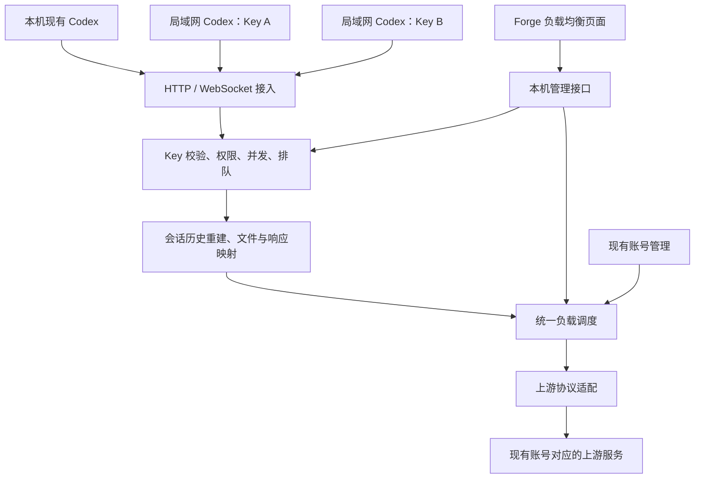

# Codex Forge 局域网负载均衡修改方案

日期：2026-09-21  
状态：待实施方案。本文不表示所有能力已经实现或通过验收。

## 1. 目标与需求边界

将 Forge 改为可供本机及局域网多人使用的模型网关：用户继续使用自己的 Codex 和原有会话，通过各自的访问 Key 接入，由网关根据负载动态选择上游账号。

必须满足：

1. 保留当前客户端已有会话、项目和用户数据，不再通过创建空白客户端作为正式接入方式。
2. 在 Forge 左侧导航增加独立的「负载均衡」页面，管理网关、多 Key、调度和运行记录。
3. 可以给局域网不同使用者分配不同 Key；Key 不绑定固定上游账号。
4. 复用现有账号管理，不增加第二套账号库或重复登录流程。
5. 将 WebSocket、服务端续接、文件 ID、服务端压缩块纳入兼容目标。
6. 按请求负载动态调度，不以永久绑定会话的方式冒充负载均衡。
7. 不自动修改或终止正在运行的原 Codex；接入和恢复操作应可检查、可回退。

本方案中的「独立页面」指 Forge 内的管理页面。局域网使用者只需客户端配置和自己的 Key，不需要安装 Forge，也不需要访问管理页面。

## 2. 当前实现需要纠正的地方

| 当前行为 | 问题 | 修改方向 |
| --- | --- | --- |
| 启动独立 CODEX_HOME 和桌面用户数据目录 | 新窗口不显示原会话 | 正式接入保留原客户端目录和数据 |
| 负载均衡放在设置页 | 不便管理多人接入和运行状态 | 增加独立导航与页面 |
| 一个本机 Key，监听回环地址 | 无法按人管理局域网访问 | 多 Key、局域网监听、使用者隔离 |
| 简单 Python HTTP 转发 | 难以承载完整 WS 和有状态协议 | 引入可定制的协议服务 |
| 直接拒绝续接、文件 ID 和压缩块 | 无法覆盖完整客户端流程 | 增加历史重建和资源映射 |
| 只显示网关「运行中」 | 容易被理解为客户端已成功接入 | 区分监听状态、客户端连接和成功请求 |

当前代码为独立客户端创建了新目录，并未将原会话迁走；新窗口不展示旧会话不能被当作正式接入的可接受结果。具体原会话位置需在接入前核实，不执行目录清理或覆盖。

## 3. GitHub 调研与选型

以下是本次调查发现的参考实现，不代表直接安装后即可满足全部需求。正式引入时应锁定经过审查的版本或提交，记录许可证和修改内容。

### 3.1 CLIProxyAPI：优先参考协议服务

- 项目：https://github.com/router-for-me/CLIProxyAPI
- 配置：https://github.com/router-for-me/CLIProxyAPI/blob/main/config.example.yaml
- WebSocket 处理：https://github.com/router-for-me/CLIProxyAPI/blob/main/sdk/api/handlers/openai/openai_responses_websocket.go

已查看的实现包含多 Key、监听地址、TLS、账号选择，以及 Responses WebSocket 的事件处理、历史归并和连接管理。代码也包含固定账号、连接专属续接状态等处理；关闭普通会话粘性并不等于所有请求都可以跨账号转发。

推荐以其协议代码为基础定制 Go 网关，由 Forge 提供账号来源和调度规则。不能让 Forge 和底层服务分别再选一次账号，也不能直接沿用所有默认重试行为。

### 3.2 Sub2API：参考多人管理和压缩兼容

- 项目：https://github.com/Wei-Shaw/sub2api
- Responses 与压缩处理：https://github.com/Wei-Shaw/sub2api/blob/main/backend/internal/handler/openai_gateway_handler.go
- 路径归一化：https://github.com/Wei-Shaw/sub2api/blob/main/backend/internal/handler/endpoint.go

已查看的实现包含 Key 分发、并发管理、续接限制，以及传统 compact 路径与通过请求内容触发的新版压缩处理。

其完整部署包含 PostgreSQL、Redis 等组件。本项目优先借鉴相关设计，不直接把完整平台及第二套账号管理嵌入 Forge。

### 3.3 调研结论与未确认项

- 存在可借鉴的 WS、续接和压缩实现，但需要结合当前 Codex 版本验证。
- 之前一次 `/responses/compact` 返回 404，仅说明当次请求未成功，不能证明所有服务端压缩协议不可实现。
- 本次未找到可以直接保证 Codex 订阅账号之间任意迁移文件 ID 的完整实现，需要资源映射层及真实上游测试。
- 上游原生状态、文件资源和压缩内容是否可跨账号使用，不能仅凭代理项目声明推定。

补充参考：

- 官方 WebSocket 状态与恢复：https://developers.openai.com/api/docs/guides/websocket-mode
- 官方文件输入：https://developers.openai.com/api/docs/guides/file-inputs
- 官方自定义服务配置：https://learn.chatgpt.com/docs/config-file/config-advanced

公开 API 文档用于理解协议，不直接证明 Codex 订阅接口具有完全相同的能力。

## 4. 整体架构



职责划分：

| 组件 | 职责 |
| --- | --- |
| Forge React 页面 | 服务配置、Key 管理、账号状态、使用统计与接入说明 |
| Electron 主进程 | 网关进程生命周期、本机管理通道、状态同步 |
| 现有 Python 账号服务 | 账号权威数据、认证读取、协调令牌刷新 |
| 定制 Go 网关 | HTTP/WS、流式协议、请求准入、统一调度、状态和资源映射 |
| SQLite 与本地资源存储 | Key 校验信息、使用者、映射元数据、有限期历史及文件 |

账号仍以 Forge 现有数据为准。网关如需缓存认证，只能作为受控的派生缓存，不能成为独立维护的账号库；凭据不经过界面，不放入命令行参数或普通日志。

## 5. 保留已有会话的接入方式

### 5.1 正式入口

移除页面上的「启动负载均衡客户端」，改为：

- 接入当前客户端。
- 查看接入配置。
- 恢复原配置。

本机接入沿用原来的 CODEX_HOME、桌面用户数据目录、会话数据库和项目列表。只调整必要的模型服务和认证配置，不创建空白用户目录，不批量复制或覆盖会话数据库。

### 5.2 接入步骤

1. 识别目标客户端实际使用的目录、配置和运行进程。
2. 展示将修改的服务地址及配置项，备份原值。
3. 检查已有任务是否保存了单独的服务商绑定。
4. 优先通过客户端支持的配置或任务更新接口切换；不直接猜测并批改 SQLite 数据。
5. 在当前生成结束后应用变更；如需重启，明确提示，不自动终止进程。
6. 打开原任务继续对话，确认显示、上下文和网关请求记录均正常。

回退时恢复本功能修改的配置项，并检测期间是否发生用户编辑，不用旧备份覆盖无关的新设置。

### 5.3 必须验证的边界

保留文件目录不等于旧任务可以使用新服务。需要分别验证：

- 本地历史是否仍展示。
- 原任务继续对话是否走网关。
- 项目、插件和工具是否仍可用。
- 原任务中的外部响应 ID、附件等状态能否迁移。
- 云端会话及账号专属功能是否需要原登录，不将它们直接等同于本地任务。

如果当前客户端版本无法通过受支持方式切换某类旧任务，必须明确列出兼容阻碍，不能再次用新建空白客户端替代验收。

## 6. 独立管理页面

左侧导航新增「负载均衡」，建议划分为以下区域：

| 区域 | 内容 |
| --- | --- |
| 服务总览 | 总开关、监听状态、本机和局域网地址、连接数、活动请求、排队数 |
| 访问 Key | 创建、命名、备注使用者、停用、撤销、轮换、有效期、并发上限 |
| 账号调度 | 复用现有账号、参与开关、可用额度、并发、冷却、协议能力 |
| 接入说明 | 按 Key 生成本机或局域网客户端配置，显示连接测试结果 |
| 请求与统计 | 使用者、Key 标识、模型、上游账号、耗时、结果、调度或失败原因 |

状态明确分为「网关监听中」「客户端已连接」「已有请求成功完成」。不能仅凭监听成功显示“接入成功”。

## 7. 多 Key 与局域网访问

### 7.1 Key 管理

- 每个使用者可分配独立 Key；同一使用者可轮换 Key。
- Key 不固定绑定某个上游账号。
- Key 明文仅在创建时显示，持久化保存校验值及必要的标识前缀。
- 支持启停、撤销、到期时间、并发上限；使用量按 Key 和使用者统计。
- 后续额度上限只能基于实际可获取的使用量实现，不把估算值当作准确账单。
- Key 撤销或到期后拒绝新请求和 WS 中的新一轮生成；已开始的请求默认允许结束。

使用者采用稳定内部 ID。Key 轮换后可以继续访问该使用者已有的网关状态；不同使用者之间不能凭响应 ID 或文件 ID 越权读取。

### 7.2 网络与管理隔离

- 默认仍为本机监听；启用局域网共享时选择网卡或监听地址。
- 页面展示真正可连接的局域网地址，不把 `0.0.0.0` 当作客户端地址。
- 支持 HTTPS/WSS 和指定访问网段；客户端正常校验证书，不通过关闭证书校验接入。
- HTTP 与 WebSocket 均执行 Key 校验，WS 后续生成也检查 Key 是否仍有效。
- 管理接口保留在本机 IPC 或受控回环通道，普通调用 Key 不具有管理权限。
- 窗口隐藏到托盘时服务可继续运行；退出 Forge 会影响局域网使用者，需显示活动请求和明确的停止状态。

## 8. 动态调度规则

调度单位是一次模型生成请求，不是整段会话，也不是每一个流式分片。

1. 校验 Key、使用者权限、模型与协议需求。
2. 准备可迁移的历史和文件状态。
3. 过滤禁用、过期、额度耗尽、冷却、满载或协议不兼容的账号。
4. 按活动请求数相对于账号并发上限的负载选择账号；相同负载轮转。
5. 同一生成过程由同一账号完成；下一次生成重新评估负载。
6. 暂时满载时进入有限队列，设置最大等待时间和队列长度，按 Key 公平分配。
7. 成功、失败、取消和断线都释放容量；空闲 WS 连接单独计数，不永久占用模型生成配额。

不自动更换用户选择的模型。失败重试需区分是否已被上游接受、是否已输出、是否包含工具执行；对结果不确定的请求不能无条件重放或承诺“恰好一次”。

## 9. 四项协议兼容设计

### 9.1 WebSocket

实现真实握手、事件流、心跳、关闭原因、取消、断线恢复及必要的背压处理，不只返回错误让客户端回落到 HTTP。

客户端连接与上游连接分开管理。在完整上下文可重建时，同一个客户端连接中的下一次生成可以分配到不同账号。已经开始的生成或必须使用当前上游状态的并行输入，不能在中途强行换账号。

验收覆盖普通多轮、工具循环、取消、断线重连以及连接存活期间的 Key 撤销。

### 9.2 服务端续接

为经过网关的请求建立可恢复记录：输入、完整输出、响应 ID、父响应关系、工具调用及结果、上游账号和连接信息。

收到 `previous_response_id` 或相关会话引用时：

1. 验证资源归属。
2. 查找网关记录并校验历史完整性。
3. 如需换账号，将增量输入与既有历史正确合并，向新上游建立可继续的上下文。
4. 正确映射和转发所有相关响应 ID；不只修改顶层 ID。
5. 去重工具项，保持调用与结果一一对应，防止重复注入或重复执行。

网关从未接收过的旧响应 ID 无法凭空恢复。必须由客户端补齐历史或通过有权限的来源恢复；失败时明确说明，不能直接清空 `previous_response_id` 丢失上下文。

### 9.3 文件 ID

增加网关文件资源管理，覆盖上传、查询、读取和删除等接入场景。先确认实际客户端使用的上传协议和上游能力，再确定具体接口适配。

设计映射：

```text
使用者 + 网关文件 ID
    → 原始文件及元数据
    → 账号 A 的上游文件 ID
    → 账号 B 的上游文件 ID
```

切换账号时，根据已验证的上游能力重新上传原文件或采用保持内容语义的文件输入形式。上传映射要防并发重复创建，并处理文件大小、保留期限、删除和失败清理。

不能把 PDF、图片等文件一律替换为纯文本并声称完整支持。对不经过网关上传、又无法取得原文件的外部 ID，只能在有权限且能够解析原资源的条件下迁移。

### 9.4 服务端压缩块

同时调查并适配传统 compact 路径和新版由请求内容、特性头等触发的压缩流程。

- 保留必要的请求元数据，不用普通 Responses 的固定字段规则套用所有压缩请求。
- 完整处理压缩输出事件，不能只累积文本 delta 或只看最终 completed 对象。
- 原样保存不透明压缩块，并关联生成它的账号、模型、协议和历史检查点。
- 验证压缩块是否能直接跨账号使用；不能依据加密推理成功就推定所有压缩块均可迁移。
- 如不能直接迁移，只能在历史完整、上游支持时研究在目标账号重新生成压缩状态，并验证上下文与工具状态保真。

客户端普通文本摘要的压缩已经测试过，但它不能替代服务端压缩块验收。

### 9.5 动态迁移的共同边界

“支持协议”和“任意状态都能跨账号迁移”是两个独立验收项。

对完整历史及可迁移资源，按负载调度；对可重建状态，重建后再调度。对无法取得或无法重建的状态，明确返回不可迁移原因，不偷偷丢字段，也不把长期固定账号包装成动态均衡。

如果上游存在无法克服的账号或连接绑定，应在协议验证阶段报告证据和具体受限场景。不能先承诺所有能力无条件可迁移，再在实现中悄悄改变需求。

## 10. 数据、刷新和生命周期

新增的逻辑数据包含使用者、访问 Key、请求元数据、响应链、文件映射和压缩检查点。它们不替代已有账号表。

历史与文件是支持迁移所需的业务数据，不属于普通日志：需按使用者隔离、加密保存，提供期限、容量和清理规则。网关重启后只恢复必要的状态映射，不自动重放未完成请求；原上游 WS 连接状态不能假定仍然存在。

令牌刷新由现有账号服务协调：同一账号只允许一个刷新操作，原子写回认证后通知网关更新缓存。需先核实现有桌面实例也在刷新时的并发行为，不能同时启用互不协调的两套刷新机制。

关闭总开关后停止新请求和新一轮生成，终止队列等待，已开始的请求尽量结束。页面应显示排空进度；异常退出后将未完成请求标为结果不确定，不自动重试工具操作。

## 11. 代码修改范围

以下为计划范围，具体模块划分以实现时核对为准：

| 位置 | 计划修改 |
| --- | --- |
| `src/renderer/src/App.tsx`、视图类型和导航元数据 | 增加负载均衡页面入口 |
| `src/renderer/src/pages/SettingsPage.tsx` | 移除现有负载均衡大块设置 |
| 当前 `LoadBalancerSettings.tsx` | 拆分迁移为独立页面及其功能组件 |
| `src/main/loadBalancer.ts`、IPC 与进程启动代码 | 管理新网关、本机控制通道和客户端接入状态 |
| `python/core/load_balancer_client.py` | 正式入口不再创建空白客户端，替换为原配置接入与恢复逻辑 |
| `python/core/load_balancer.py` | 简易转发器逐步退出正式路径，避免两套调度同时工作 |
| 现有账号服务和数据库 | 提供统一账号适配、刷新协调及必要的数据迁移 |
| 新增 Go 网关模块 | 协议、调度、Key 校验、队列、状态和资源管理 |
| 测试与文档 | 增加跨账号、多使用者、局域网和回退验收 |

已有会话数据库不作为默认直接修改对象。保留当前未提交改动，只调整与本需求相关的代码。

## 12. 实施顺序

### 阶段一：先验证最难的兼容条件

- 验证原客户端和旧任务可以接入并恢复。
- 使用两个测试账号验证 WS 工具循环和增量续接迁移。
- 验证文件上传后跨账号使用。
- 验证服务端压缩产生的块在下一账号继续使用，或验证可行的重建流程。

产出：按客户端版本、账号类型和协议场景记录的能力矩阵。无法实现的场景先给证据，不先扩大页面开发。

### 阶段二：正式网关与统一账号接入

- 锁定协议代码版本，接入现有账号管理。
- 完成统一调度、有限排队、取消和刷新协调。
- 实现多使用者状态隔离与资源映射。

### 阶段三：独立页面和多 Key 接入

- 新导航、页面、Key 生命周期及统计。
- 本机与局域网地址配置。
- 原客户端接入与恢复、每个 Key 对应的使用说明。

### 阶段四：联合验收

- 两台机器、两个 Key 同时使用。
- 验证账号切换、满载、过期、撤销、断线和网关重启。
- 完成原会话和四类协议的真实测试，输出可复查记录。

## 13. 验收清单

| 验收项 | 通过标准 |
| --- | --- |
| 保留原会话 | 原客户端中的旧任务、项目仍展示，旧任务能继续对话 |
| 实际接入 | 旧任务的请求能在网关中对应到 Key、模型和上游账号 |
| 配置回退 | 恢复原服务后仍能使用原任务，不覆盖无关设置 |
| 多 Key | 两个 Key 可同时调用，可独立限流与撤销，不固定账号 |
| 局域网 | 另一台机器通过所展示地址接入，HTTP 和 WS 均鉴权 |
| 用户隔离 | 不同使用者不能读取彼此的响应、文件和历史 |
| 动态调度 | 同一任务的多个生成请求按负载分配，记录能够证明发生跨账号调用 |
| WebSocket | 多轮、工具循环、取消及断线恢复通过，不能仅测试握手 |
| 续接 | 增量输入跨账号后历史正确、工具项不重复 |
| 文件 ID | 上传后跨账号仍可使用原文件内容，删除与权限检查正确 |
| 服务端压缩 | 真实服务端压缩输出参与后续跨账号请求，上下文与工具状态正确 |
| 排队与刷新 | 满载等待有界、公平分配；认证刷新无竞争和半写入 |
| 不确定结果 | 断线或崩溃不导致工具被无条件自动重放 |

最终完成标准：保留用户原会话，局域网使用者拿自己的 Key 即可接入，且所要求的协议通过真实跨账号测试。开关可用、端口监听、静态检查通过或新建空白会话成功，都不能单独算作完成。
